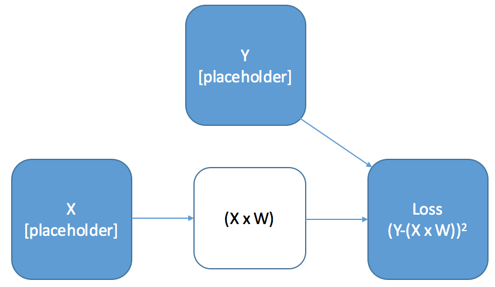
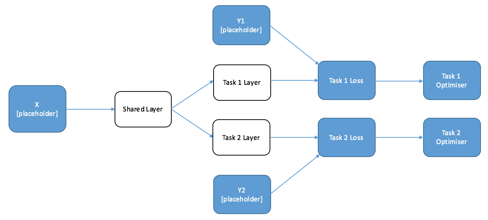
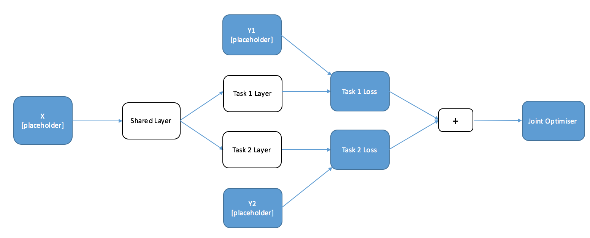

### A step-by-step tutorial on how to create multi-task neural nets in Tensorflow.

-----

# Introduction

## Why Multi-Task Learning

When you think about the way people learn to do new things, they often use their experience and knowledge of the world to speed up the learning process. When I learn a new language, especially a related one, I use my knowledge languages I already speak to make shortcuts. The process works the other way too - learning a new language can help you understand and speak your own better.

Our brains learn to do multiple different tasks at the same time - we have the same brain architecture whether we are translating English to German or English to French. If we were to use a Machine Learning algorithm to do both of these tasks, we would call 'multi-task' learning.

It's one of the most interesting and exciting areas of research for Machine Learning in coming years, radically reducing the amount of data required to learn new concepts. One of the great promises of Deep Learning is that, with the power of the models and simple ways to share parameters between tasks, we should be able to make significant progress in multi-task learning.

As I started to experiment in this area I came across a bit of a road block - while it was an easy to understand the architecture changes required to implement multi-task learning, it was harder to figure out how to implement it in Tensorflow. To do anything but standard nets in Tensorflow requires a good understanding of how Tensorflow works, but most of the stock examples don't provide helpful guidance. I hope the following tutorial explains some key concepts simply, and helps those who are struggling.

## What We Are Going To Do

### Part 1
1. **Understand Tensorflow Computation Graphs With An Example**. Doing multi-task learning with Tensorflow requires understanding how computation graphs work - skip if you already know.

2. **Understand How We Can Use Graphs For Multi-Task Learning**. We'll go through an example of how to adapt a simple graph to do Multi-Task Learning.

### Part 2
3. **Build A Graph for POS Tagging and Shallow Parsing**. We'll fill in a template that trains a net for two related linguistic tasks. Don't worry, you don't need to know what they are!

4. **Train A Net Jointly And Separately**. We'll actually train a model in two different ways. You should be able to do this on your laptop.

------

# Understanding Computation Graphs With A Toy Example

The Computation Graph is the thing that makes Tensorflow (and other similar packages) fast. It's an integral part of machinery of Deep Learning, but can be confusing.

There are some neat features of a graph that mean it's very easy to conduct multi-task learning, but first we'll keep things simple and explain the key concepts.

------

### Definition: Computation Graph

The **Computation Graph** is a **template** for computation (re: algorithm) you are going to run. It **doesn't perform any calculations**, but it means that your computer can conduct backpropagation far more quickly.

If you ask Tensorflow for a **result of a calculation** it will **only make those calculations required** for the job, **not the whole graph**.

------

## A Toy Example - Linear Transformation: Setting Up The Graph

We're going to look at the graph for a simple calculation - a linear transformation of our inputs, and taking the square loss:


# Import Tensorflow
import tensorflow as tf

# ======================
# Define the Graph
# ======================

# Create Placeholders For X And Y (for feeding in data)
X = tf.placeholder("float",[10, 10],name="X") # Our input is 10x10
Y = tf.placeholder("float", [10, 1],name="Y") # Our output is 10x1

# Create a Trainable Variable, "W", our weights for the linear transformation
W = tf.Variable([10,1], "W")

# Define Your Loss Function
Loss = tf.pow(tf.add(Y,-tf.matmul(X,W)),2,name="Loss")



There are a few things to emphasis about this graph:

* **If we were to run this code right now, we would get no output**. Remember that a Computation Graph is just a template - it doesn't do anything. If we want an answer, we have to tell Tensorflow to run the computation using a **Session**.

* **We haven't explictly created a graph object**. You might expect that we would have a create a graph object somewhere in order for Tensorflow to know that we wanted to create a graph. In fact, by using the tensorflow operations, we are telling Tensorflow what parts of our code are in the graph.

**Tip: Keep Your Graph Separate**. You'll typically be doing a fair amount data manipulation and computation outside of the graph, which means keeping track of what is and isn't available inside of python a bit confusing. I like to put my graph in a separate file, and often in a separate class to keep concerns separated, but this isn't required.

## A Toy Example - Linear Transformation: Getting Results

Computations on your Graph are conducted inside a tensorflow **Session**. To get results from your session you need to provide it with two things: Target Results and Inputs.

1. **Target Results or Operations**. You tell tensorflow what parts of the graph you want to return values for, and it will **automatically figure out what calculations within need to be run**. You can also call operations, for example to initialise your variables.

2. **Inputs As Required ('Feed Dict')**. Some calculations will you to provide data. In this case, you construct the graph with a **placeholder** for this data, and feed it in at computation time. Not all calculations or operations will require an input - for many, all the information is already contained in the graph.


# Import Tensorflow
import tensorflow as tf
import numpy as np

# ======================
# Define the Graph
# ======================

# Create Placeholders For X And Y (for feeding in data)
X = tf.placeholder("float",[10, 10],name="X") # Our input is 10x10
Y = tf.placeholder("float", [10, 1],name="Y") # Our output is 10x1

# Create a Trainable Variable, "W", our weights for the linear transformation
W = tf.Variable([10,1], "W")

# Define Your Loss Function
Loss = tf.pow(tf.add(Y,-tf.matmul(X,W)),2,name="Loss")

# ======================
# Run The Computation Using A Session
# ======================

with sess = tf.session(): # set up the session
  Model_Loss = sess.run(
                Loss, # the first argument is the name of the tensorflow variabl you want to return
                { # the second argument is the data for the placeholders
                  X: np.random([10,10]),
                  Y: np.randomd([10,1])
                })


------

# How To Use Graphs for Multi-Task Learning

When we create a Neural Net that performs multiple tasks we want to have some parts of the network that are shared, and other parts of the network that are specific to each individual task. When we're training, we want information from each task to be transferred in the shared parts of the network.

So, to start, let's draw a diagram of a simple two-task network that has a shared layer and a specific layer for each individual task. We've going to feed the outputs of this into our loss function with our targets. I've labelled where we're going to want to create placeholders in the graph.


#  GRAPH CODE
# ============

# Import Tensorflow
import tensorflow as tf

# ======================
# Define the Graph
# ======================

# Define the Placeholders
X = tf.placeholder("float", [10, 10], name="X")
Y1 = tf.placeholder("float", [10, 1], name="Y1")
Y2 = tf.placeholder("float", [10, 1], name="Y2")

# Define the weights for the layers
shared_layer_weights = tf.Variable([10,20], name="share_W")
Y1_layer_weights = tf.Variable([20,1], name="share_Y1")
Y2_layer_weights = tf.Variable([20,1], name="share_Y2")

# Construct the Layers with RELU Activations
shared_layer = tf.nn.relu(tf.matmul(X,shared_layer_weights))
Y1_layer = tf.nn.relu(tf.matmul(shared_layer,Y1_layer_weights))
Y2_layer_weights = tf.nn.relu(tf.matmul(shared_layer,Y2_layer_weights))

# Calculate Loss
Y1_Loss = tf.nn.l2_loss(Y1,Y1_layer)
Y2_Loss = tf.nn.l2_loss(Y2,Y2_layer)



When we are training this network, **we want the parameters of the Task 1 layer to not change no matter how wrong we get Task 2**, but **the parameters of the shared layer to change with both tasks**. This might seem a little difficult - normally you only have one optimiser in a graph, because you only optimise one loss function. Thankfully, using the properties of the graph it's very easy to train this sort of model in two ways.

## Alternate Training

The first solution is particularly suited to situations where you'll have a batch of Task 1 data and then a batch of Task 2 data.

Remember that Tensorflow automatically figures out which calculations are needed for the operation you requested, and only conducts those calculations. This means that **if we define an optimiser on only one of the tasks, it will only train the parameters required to compute that task - and will leave the rest alone**. Since Task 1 relies only on the Task 1 and Shared Layers, the Task 2 layer will be untouched. Let's draw another diagram with the desired optimisers at the end of each task.


#  GRAPH CODE
# ============

# Import Tensorflow
import tensorflow as tf

# ======================
# Define the Graph
# ======================

# Define the Placeholders
X = tf.placeholder("float", [10, 10], name="X")
Y1 = tf.placeholder("float", [10, 1], name="Y1")
Y2 = tf.placeholder("float", [10, 1], name="Y2")

# Define the weights for the layers
shared_layer_weights = tf.Variable([10,20], name="share_W")
Y1_layer_weights = tf.Variable([20,1], name="share_Y1")
Y2_layer_weights = tf.Variable([20,1], name="share_Y2")

# Construct the Layers with RELU Activations
shared_layer = tf.nn.relu(tf.matmul(X,shared_layer_weights))
Y1_layer = tf.nn.relu(tf.matmul(shared_layer,Y1_layer_weights))
Y2_layer_weights = tf.nn.relu(tf.matmul(shared_layer,Y2_layer_weights))

# Calculate Loss
Y1_Loss = tf.nn.l2_loss(Y1,Y1_layer)
Y2_Loss = tf.nn.l2_loss(Y2,Y2_layer)

# Create Optimisers
Y1_Op = tf.train.AdamOptimizer().minimize(Y1_Loss) # Adam Optimizer
Y2_Op = tf.train.AdamOptimizer().minimize(Y2_Loss) # Adam Optimizer


We can conduct Multi-Task learning by alternately calling each task optimiser, which means we can continually transfer some of the information from each task to the other. In a loose sense, we are discovering the 'commonality' between the tasks. The following code implements this for our easy example. If you are following along, paste this at the bottom of the previous code:


# Calculation (Session) Code
# ==========================

# open the session
with tf.session as session:
  for iters in range(10):
    if np.random() < 0.5:
      _, Y1_loss = session.run([Y1_op, Y1_loss],
                        {
                          X: np.random([10,20]),
                          Y1: np.random([20,1]),
                          Y2: np.random([20,1])
                          })
      print(Y1_loss)
    else:
      _, Y2_loss = session.run([Y1_op, Y1_loss],
                        {
                          X: np.random([10,20]),
                          Y1: np.random([20,1]),
                          Y2: np.random([20,1])
                          })
      print(Y2_loss)


### Tips: When is Alternate Training Good?

Alternate training is a good idea when you have two different datasets for each of the different tasks (for example, translating from English to French and English to German). By designing a network in this way, you can improve the performance of each of your individual tasks without having to find more task-specific training data.

Alternate training is the most common situation you'll find yourself in, because there aren't that many datasets that have two or more outputs. We'll come on to one example, but the clearest examples are where you want to build hierarchy into your tasks. For example, in vision, you might want one of your tasks to predict the rotation of an object, the other what the object would look like if you changes the camera angle. These two tasks are obviously related - in fact the rotation probably comes before the image generation.

### Tips: When is Alternate Training Less Good?

Alternate training can easily become biased towards a specific task. The first way is obvious - if one of your tasks has a far larger dataset than the other, then if you train in proportion to the dataset sizes your shared layer will contain more information about the more significant task.

The second is less so. If you train alternately, the final task your model see will create a bias in the parameters. There isn't any obvious way that you can overcome this problem, but it does that mean that in circumstances where you don't have to train alternately, you shouldn't.

## Training at the Same Time - Joint Training

When you have a dataset with multiple labels for each input, what you really want is to train the tasks at the same time. The question is, how do you preserve the independence of the task-specific functions? The answer is surprisingly simple - you just add up the loss functions of the individual tasks and optimise on that. Below is a diagram that shows a network that can train jointly, with the accompanying code:


#  GRAPH CODE
# ============

# Import Tensorflow
import tensorflow as tf

# ======================
# Define the Graph
# ======================

# Define the Placeholders
X = tf.placeholder("float", [10, 10], name="X")
Y1 = tf.placeholder("float", [10, 1], name="Y1")
Y2 = tf.placeholder("float", [10, 1], name="Y2")

# Define the weights for the layers
shared_layer_weights = tf.Variable([10,20], name="share_W")
Y1_layer_weights = tf.Variable([20,1], name="share_Y1")
Y2_layer_weights = tf.Variable([20,1], name="share_Y2")

# Construct the Layers with RELU Activations
shared_layer = tf.nn.relu(tf.matmul(X,shared_layer_weights))
Y1_layer = tf.nn.relu(tf.matmul(shared_layer,Y1_layer_weights))
Y2_layer_weights = tf.nn.relu(tf.matmul(shared_layer,Y2_layer_weights))

# Calculate Loss
Y1_Loss = tf.nn.l2_loss(Y1,Y1_layer)
Y2_Loss = tf.nn.l2_loss(Y2,Y2_layer)

# Calculate Joint Loss
Joint_Loss = tf.add(Y1_Loss,Y2_Loss)

# Graph Optimiser
Optimiser = tf.train.AdamOptimizer().minimize(Joint_Loss) # Adam Optimizer



## Conclusions and Next Steps

In this post we've gone through the basic principles behind multi-task learning in deep neural nets. If you've used Tensorflow before, and have your own project, then hopefully this has given you enough to get started.

For those of you who want a more meaty, more detailed example of how this can be used to improve performance in multiple tasks, then stay tuned for part 2 of the tutorial where we'll delve into Natural Language Processing to build a multi-task model for shallow parsing and part of speech tagging.
